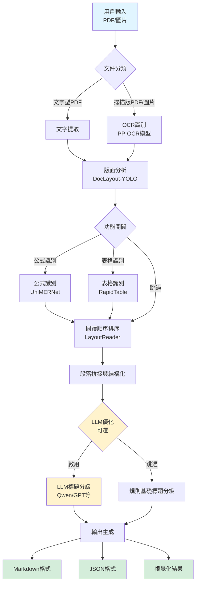
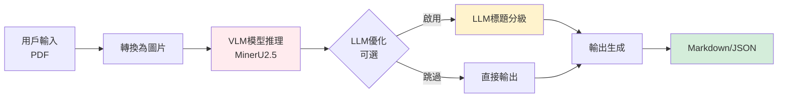

# MinerU 專案說明

## 1. 專案用途與核心解析

### 用途與核心功能

**核心功能**：MinerU 是一個智能 PDF 解析工具，能夠將 PDF 文件轉換為機器可讀的格式（如 Markdown、JSON），就像一位專業的「文件翻譯官」，能理解複雜的學術論文、技術文檔的結構和內容。

**解決的痛點**：
- **傳統 PDF 提取的困境**：一般工具只能提取純文字，無法理解文件結構（標題、段落、表格、公式的層次關係），就像把一本書的內容全部打散，失去了章節結構。
- **複雜版面的挑戰**：多欄排版、跨頁表格、數學公式、圖片說明等複雜元素，傳統方法難以準確識別和排序。
- **掃描版 PDF 的難題**：掃描版 PDF 是圖片格式，需要 OCR（光學字元識別）技術才能提取文字，但一般 OCR 工具無法理解版面結構。

MinerU 透過多個 AI 模型協同工作，不僅能「看懂」PDF 的內容，還能「理解」它的結構，最終輸出符合人類閱讀順序、保留完整結構的 Markdown 或 JSON 格式。

### 實際應用場景

想像你是一位研究生，正在撰寫論文，需要引用 50 篇相關文獻。傳統方式你需要：
1. 打開每篇 PDF
2. 手動複製標題、摘要、關鍵內容
3. 整理成統一的格式

使用 MinerU，你只需要：
1. 將所有 PDF 放入一個資料夾
2. 執行一條命令：`mineru -p ./pdfs -o ./output`
3. 幾分鐘後，所有 PDF 都被轉換成結構化的 Markdown 文件，可以直接用於：
   - 建立知識庫（如 Notion、Obsidian）
   - 訓練 AI 模型（將 PDF 轉為訓練資料）
   - 自動化文檔處理流程
   - 建立搜尋引擎（因為內容已結構化，搜尋更精準）

另一個場景：公司需要將大量歷史合約、報告數位化。傳統方式需要人工逐頁閱讀、分類、建檔。使用 MinerU 可以自動提取關鍵資訊（標題、表格、日期等），大幅提升效率。

---

## 2. 輸入與輸出 (I/O) 解析

### Input（輸入）

MinerU 接收以下類型的資料：

1. **PDF 文件**：支援文字型 PDF 和掃描版 PDF（圖片型）
2. **圖片文件**：支援 `.png`、`.jpg`、`.jpeg` 格式
3. **輸入方式**：
   - 單一文件：`mineru -p document.pdf -o output/`
   - 整個資料夾：`mineru -p ./pdf_folder -o output/`

### Output（輸出）

MinerU 會產生多種格式的輸出：

1. **Markdown 格式**（`.md`）：
   - **多模态 Markdown**：保留圖片、表格、公式的完整結構
   - **NLP Markdown**：純文字格式，適合自然語言處理

2. **JSON 格式**（`content_list.json`）：
   - 按閱讀順序排序的結構化資料
   - 包含每個區塊的類型（標題、段落、表格、圖片等）
   - 包含位置資訊（bbox 座標）

3. **中間格式**（`middle.json`）：
   - 包含更詳細的解析資訊
   - 用於二次開發和深度分析

4. **視覺化結果**：
   - `layout.pdf`：顯示版面分析結果（標示出每個區塊的位置）
   - `span.pdf`：顯示文字區塊的識別結果

### 舉例說明

**輸入範例**：
- 輸入：一篇 20 頁的學術論文 PDF（包含標題、摘要、多個章節、數學公式、表格、圖片）

**處理過程**：
1. MinerU 自動判斷這是文字型 PDF 還是掃描版
2. 識別版面結構（標題在哪、正文在哪、表格在哪）
3. 提取文字內容
4. 識別並轉換數學公式為 LaTeX 格式
5. 識別表格並轉換為 HTML 格式
6. 按照人類閱讀順序重新排列內容
7. 移除頁眉、頁腳、頁碼等干擾元素

**輸出結果**：
- 一個結構清晰的 Markdown 文件，包含：
  - 標題層級（# 一級標題、## 二級標題）
  - 完整的正文內容
  - 數學公式（以 LaTeX 格式呈現，如 `$E=mc^2$`）
  - 表格（HTML 格式）
  - 圖片引用路徑

**實際幫助**：
- 你可以直接將這個 Markdown 文件匯入到 Notion、Obsidian 等知識管理工具
- 可以用程式自動提取論文中的關鍵資訊（作者、摘要、結論等）
- 可以建立搜尋索引，快速找到相關內容

---

## 3. LLM 應用分析

### 模型識別

經過程式碼掃描，MinerU 使用了以下大型語言模型（LLM）和 AI 模型：

1. **OpenAI API 相容的 LLM**（可選功能）：
   - 用於標題分級優化
   - 支援所有符合 OpenAI 協議的模型（如 Qwen、GPT 系列等）
   - 預設使用阿里雲百煉的 `qwen2.5-32b-instruct` 模型

2. **視覺語言模型（VLM）**：
   - **MinerU2.5**：專為文件解析設計的多模態模型（1.2B 參數）
   - 用於端到端的文件理解（版面分析、文字識別、表格解析、公式識別）

3. **其他 AI 模型**（非 LLM，但屬於 AI 模型）：
   - **DocLayout-YOLO**：版面分析模型
   - **UniMERNet**：數學公式識別模型
   - **PP-OCR**：文字識別模型（支援 84 種語言）
   - **RapidTable / TableStructureRec**：表格結構識別模型

### 應用環節

#### LLM 的具體應用：標題分級優化

**位置**：`mineru/utils/llm_aided.py`

**任務描述**：
MinerU 在解析文件時，會先識別出所有標題，但這些標題的「層級關係」（哪個是一級標題、哪個是二級標題）可能不夠準確。這時，系統會呼叫 LLM 來優化標題分級。

**工作流程**：
1. 系統收集所有識別到的標題，包含：
   - 標題文字內容
   - 標題的行高（通常行高越大，標題層級越高）
   - 標題所在的頁碼
2. 將這些資訊組合成一個提示詞（Prompt），發送給 LLM
3. LLM 根據標題的文字內容、行高、位置關係，判斷每個標題應該屬於哪個層級（1-4 級）
4. 系統將 LLM 返回的結果更新到文件結構中

**為什麼需要 LLM**：
- 標題分級需要理解語義（例如「第一章」應該是一級標題，「1.1 節」應該是二級標題）
- 需要考慮上下文關係（前後標題的層級應該連續，不能跳級）
- 需要排除誤判（某些正文可能被誤判為標題，LLM 可以將其標記為 0 級來排除）

#### VLM 模型的應用：端到端文件解析

**位置**：`mineru/backend/vlm/`

**任務描述**：
MinerU2.5 是一個多模態大模型，能夠「一眼看懂」整個 PDF 頁面，同時完成：
- 版面分析（識別標題、段落、表格、圖片的位置）
- 文字識別（OCR）
- 表格結構識別
- 數學公式識別
- 閱讀順序排序

**優勢**：
- 單一模型完成多項任務，效率更高
- 理解能力更強，能處理複雜版面
- 參數僅 1.2B，但性能超越 72B 級別的大型模型

### 結果舉例

#### LLM 標題分級優化範例

**輸入給 LLM 的資料**：
```python
{
  "0": ["第一章 緒論", 24, 1],      # [標題文字, 行高, 頁碼]
  "1": ["1.1 研究背景", 18, 2],
  "2": ["1.2 研究目的", 18, 2],
  "3": ["第二章 文獻回顧", 24, 5]
}
```

**LLM 返回的結果**：
```python
{
  0: 1,  # 第一章是一級標題
  1: 2,  # 1.1 是二級標題
  2: 2,  # 1.2 是二級標題
  3: 1   # 第二章是一級標題
}
```

**最終效果**：
在輸出的 Markdown 中，標題會自動加上正確的層級標記：
```markdown
# 第一章 緒論
## 1.1 研究背景
## 1.2 研究目的
# 第二章 文獻回顧
```

#### VLM 模型解析結果範例

**輸入**：一頁包含標題、正文、表格、公式的 PDF

**VLM 輸出**：
- 識別出標題位置和內容：「實驗結果」
- 識別出正文段落：「我們進行了以下實驗...」
- 識別出表格結構（行、列、單元格內容）
- 識別出公式並轉換為 LaTeX：`$\sum_{i=1}^{n} x_i = 0$`
- 按照閱讀順序排列所有元素

---

## 4. 配置參數影響分析

### 自動掃描結果

MinerU 的配置主要通過以下方式管理：

1. **配置檔案**：`mineru.json`（位於用戶目錄 `~` 下）
   - 模板檔案：`mineru.template.json`
   - 讀取邏輯：`mineru/utils/config_reader.py`

2. **環境變數**：
   - `MINERU_DEVICE_MODE`：指定運算設備
   - `MINERU_FORMULA_ENABLE`：是否啟用公式識別
   - `MINERU_TABLE_ENABLE`：是否啟用表格識別
   - `MINERU_MODEL_SOURCE`：模型來源（huggingface/modelscope/local）
   - `MINERU_MIN_BATCH_INFERENCE_SIZE`：批次推理大小

3. **命令行參數**：
   - `--backend`：選擇後端（pipeline/vlm-transformers/vlm-vllm-engine）
   - `--lang`：指定 OCR 語言
   - `--method`：解析方法（auto/txt/ocr）

### 重要配置參數說明

#### 1. `llm-aided-config`（LLM 輔助配置）

**位置**：`mineru.json` 中的 `llm-aided-config` 區塊

**參數結構**：
```json
{
  "llm-aided-config": {
    "title_aided": {
      "api_key": "your_api_key",
      "base_url": "https://dashscope.aliyuncs.com/compatible-mode/v1",
      "model": "qwen2.5-32b-instruct",
      "enable": false
    }
  }
}
```

**影響說明**：
- **`enable`**：是否啟用 LLM 標題分級優化
  - `true`：系統會呼叫 LLM 來優化標題層級，讓標題分級更準確、更符合邏輯
  - `false`：使用規則基礎的方法進行標題分級（預設）
  - **調整建議**：如果文件標題結構複雜，建議啟用此功能

- **`api_key`**：LLM API 的密鑰
  - 需要自行申請（支援 OpenAI、阿里雲百煉等）
  - 如果未設定，即使 `enable=true` 也不會生效

- **`base_url`**：LLM API 的服務端點
  - 預設為阿里雲百煉的端點
  - 可以改為其他支援 OpenAI 協議的服務

- **`model`**：使用的 LLM 模型名稱
  - 預設為 `qwen2.5-32b-instruct`（32B 參數的大模型）
  - 可以改為其他模型，但建議使用 7B 以上的模型以獲得較好效果

#### 2. `latex-delimiter-config`（LaTeX 公式分隔符配置）

**位置**：`mineru.json` 中的 `latex-delimiter-config` 區塊

**參數結構**：
```json
{
  "latex-delimiter-config": {
    "display": {
      "left": "$$",
      "right": "$$"
    },
    "inline": {
      "left": "$",
      "right": "$"
    }
  }
}
```

**影響說明**：
- **`display.left/right`**：獨立成行的公式（如大公式）使用的分隔符
  - 預設為 `$$`（Markdown 標準格式）
  - 如果改為 `\[` 和 `\]`，輸出會變成 LaTeX 格式
  - **調整建議**：如果後續需要編譯 LaTeX，可以改為 `\[` 和 `\]`

- **`inline.left/right`**：行內公式（如 $E=mc^2$）使用的分隔符
  - 預設為 `$`（Markdown 標準格式）
  - 如果改為 `\(` 和 `\)`，輸出會變成 LaTeX 格式

#### 3. `models-dir`（模型目錄配置）

**位置**：`mineru.json` 中的 `models-dir` 區塊

**參數結構**：
```json
{
  "models-dir": {
    "pipeline": "/path/to/pipeline/models",
    "vlm": "/path/to/vlm/models"
  }
}
```

**影響說明**：
- **`pipeline`**：指定 pipeline 後端使用的模型存放目錄
  - 如果設定，並將 `MINERU_MODEL_SOURCE=local`，系統會從本地讀取模型
  - **適用場景**：內網環境、離線部署、加速載入（避免每次下載）

- **`vlm`**：指定 VLM 後端使用的模型存放目錄
  - 同樣支援本地模型讀取
  - **調整建議**：如果網路環境不佳，建議先下載模型到本地，再設定此參數

#### 4. 環境變數：`MINERU_DEVICE_MODE`

**影響說明**：
- **`cuda`**：使用 NVIDIA GPU 加速（最快）
- **`mps`**：使用 Apple Silicon（M1/M2/M3）GPU 加速
- **`npu`**：使用華為昇騰 NPU 加速（中國信創環境）
- **`cpu`**：純 CPU 運算（最慢，但不需要 GPU）
- **調整建議**：如果有 GPU，建議設定為 `cuda` 或 `mps`，速度可提升 10-50 倍

#### 5. 環境變數：`MINERU_FORMULA_ENABLE` 和 `MINERU_TABLE_ENABLE`

**影響說明**：
- **`MINERU_FORMULA_ENABLE=false`**：關閉公式識別
  - 速度提升約 30-50%
  - 適用於：不需要提取公式的文件（如純文字報告）
- **`MINERU_TABLE_ENABLE=false`**：關閉表格識別
  - 速度提升約 20-40%
  - 適用於：沒有表格的文件

#### 6. 命令行參數：`--backend`

**影響說明**：
- **`pipeline`**：傳統流水線方式，模組化設計，靈活度高
  - 優點：支援 CPU、可選功能（公式/表格）可開關、記憶體需求較低
  - 缺點：速度較慢
- **`vlm-transformers`**：使用 VLM 模型，端到端處理
  - 優點：準確度高、處理複雜版面能力強
  - 缺點：需要 GPU、記憶體需求較高（8GB+）
- **`vlm-vllm-engine`**：使用 vLLM 加速的 VLM 模型
  - 優點：速度最快（比 transformers 快 20-30 倍）
  - 缺點：需要 GPU、記憶體需求高（8GB+）、需要額外安裝 vLLM

---

## 5. 執行流程與系統架構

### 執行步驟

根據程式碼邏輯，MinerU 的完整執行流程如下：

#### Pipeline 後端流程：

1. **文件讀取與分類**
   - 讀取 PDF 文件或圖片
   - 判斷文件類型（文字型 PDF / 掃描版 PDF / 圖片）
   - 決定使用文字提取還是 OCR

2. **版面分析（Layout Analysis）**
   - 使用 DocLayout-YOLO 模型識別版面結構
   - 標記出標題、段落、表格、圖片、公式等區塊的位置

3. **文字提取**
   - **文字型 PDF**：直接從 PDF 提取文字
   - **掃描版 PDF / 圖片**：使用 OCR 模型（PP-OCR）識別文字
   - 支援 84 種語言的 OCR

4. **公式識別（可選）**
   - 使用 UniMERNet 模型識別數學公式
   - 將公式轉換為 LaTeX 格式

5. **表格識別（可選）**
   - 使用 RapidTable / TableStructureRec 模型識別表格結構
   - 將表格轉換為 HTML 格式
   - 支援跨頁表格合併

6. **閱讀順序排序**
   - 使用 LayoutReader 模型確定內容的閱讀順序
   - 處理多欄排版、複雜版面

7. **段落拼接與結構化**
   - 將同一段落的多行文字合併
   - 處理跨欄、跨頁的段落
   - 匹配圖片/表格與其說明文字（caption）

8. **標題分級（可選 LLM 優化）**
   - 根據標題的行高、位置進行初步分級
   - 如果啟用 LLM，呼叫 LLM 優化標題層級

9. **輸出生成**
   - 生成 Markdown 格式（多模态 / NLP）
   - 生成 JSON 格式（content_list.json）
   - 生成中間格式（middle.json）
   - 生成視覺化結果（layout.pdf、span.pdf）

#### VLM 後端流程：

1. **文件讀取**
   - 讀取 PDF 並轉換為圖片

2. **VLM 模型推理**
   - 使用 MinerU2.5 模型進行端到端解析
   - 同時完成：版面分析、文字識別、表格解析、公式識別、閱讀順序排序

3. **後處理**
   - 標題分級（可選 LLM 優化）
   - 格式轉換

4. **輸出生成**
   - 與 Pipeline 後端相同

### 系統架構圖



**VLM 後端架構（簡化流程）**：



---

## 6. 公司內部應用方向

基於 MinerU 的核心技術（PDF 解析、版面理解、結構化輸出），以下是一些公司內部可以延伸應用的方向：

### 1. 智能文檔管理系統

**應用場景**：
- 將公司內部的歷史文件（合約、報告、技術文檔）自動數位化
- 建立可搜尋的知識庫

**實現方式**：
- 使用 MinerU 批量處理 PDF，轉換為結構化資料
- 將結果存入資料庫（如 Elasticsearch）
- 建立搜尋介面，支援全文搜尋、標題搜尋、日期篩選等

**價值**：
- 提升文件檢索效率（從「翻箱倒櫃找文件」變成「一鍵搜尋」）
- 減少人工建檔成本

### 2. 自動化報告生成系統

**應用場景**：
- 定期從多個 PDF 報告中提取關鍵數據（如財務報表、銷售報告）
- 自動生成摘要報告

**實現方式**：
- 使用 MinerU 提取報告中的表格和關鍵段落
- 結合 LLM（如 GPT）分析數據，生成摘要
- 自動生成週報、月報

**價值**：
- 節省管理層閱讀報告的時間
- 確保關鍵資訊不遺漏

### 3. 智能客服知識庫

**應用場景**：
- 將產品手冊、FAQ、技術文檔轉換為結構化知識
- 供客服系統或聊天機器人使用

**實現方式**：
- 使用 MinerU 處理產品文檔，提取標題、段落、表格
- 將結果轉換為向量資料庫（如 Chroma、Pinecone）
- 結合 RAG（檢索增強生成）技術，讓 AI 客服能準確回答問題

**價值**：
- 提升客服效率（AI 自動回答常見問題）
- 降低客服培訓成本

### 4. 合約審查輔助系統

**應用場景**：
- 自動提取合約中的關鍵條款（金額、日期、責任方等）
- 比對不同版本的合約差異

**實現方式**：
- 使用 MinerU 提取合約結構（標題、段落、表格）
- 使用 LLM 識別關鍵資訊（如「甲方」、「乙方」、「金額」）
- 建立比對系統，標示差異

**價值**：
- 加速合約審查流程
- 減少人為疏漏

### 5. 培訓材料自動化處理

**應用場景**：
- 將培訓 PDF 轉換為互動式學習材料
- 自動生成測驗題目

**實現方式**：
- 使用 MinerU 提取培訓內容的結構（章節、重點、範例）
- 結合 LLM 生成測驗題目
- 建立線上學習平台

**價值**：
- 提升培訓效率
- 降低培訓材料製作成本

### 6. 多語言文檔翻譯系統

**應用場景**：
- 將外語技術文檔自動翻譯並保持結構

**實現方式**：
- 使用 MinerU 提取文檔結構
- 使用翻譯 API（如 Google Translate、DeepL）翻譯內容
- 保持原有的 Markdown 結構

**價值**：
- 加速國際化進程
- 降低翻譯成本

---

## 7. 新增案例建議

### 建議測試案例：複雜學術論文（多欄排版 + 大量公式 + 跨頁表格）

**為什麼選擇這個案例**：

1. **測試版面分析能力**：
   - 學術論文通常採用雙欄排版，MinerU 需要準確識別左右欄的內容
   - 包含頁眉、頁腳、頁碼等干擾元素，測試系統能否正確過濾

2. **測試公式識別能力**：
   - 學術論文包含大量數學公式（行內公式、獨立公式、多行公式）
   - 測試 MinerU 能否準確識別並轉換為 LaTeX 格式
   - 測試複雜公式（如矩陣、積分、求和）的識別準確率

3. **測試表格處理能力**：
   - 學術論文中的表格可能跨頁（表格的一部分在第一頁，另一部分在第二頁）
   - 測試 MinerU 的跨頁表格合併功能
   - 測試複雜表格（合併單元格、多層表頭）的識別

4. **測試閱讀順序排序**：
   - 雙欄排版中，閱讀順序應該是：左欄從上到下，然後右欄從上到下
   - 如果順序錯誤，會導致內容邏輯混亂

5. **測試標題分級**：
   - 學術論文有嚴格的標題層級（Abstract、Introduction、Methodology、Results、Conclusion 等）
   - 測試 LLM 標題分級功能是否能正確識別層級

**具體測試步驟**：

1. 選擇一篇包含以下元素的學術論文 PDF：
   - 雙欄排版
   - 至少 10 個數學公式（包含行內和獨立公式）
   - 至少 2 個跨頁表格
   - 至少 3 層標題結構

2. 使用 MinerU 解析：
   ```bash
   mineru -p paper.pdf -o output/ --backend pipeline
   ```

3. 檢查輸出結果：
   - **Markdown 文件**：檢查標題層級是否正確、公式是否完整、表格是否正確合併
   - **JSON 文件**：檢查閱讀順序是否正確（可以對比原始 PDF）
   - **視覺化結果**：檢查版面分析是否準確

4. 如果發現問題，可以：
   - 嘗試啟用 LLM 標題分級：在 `mineru.json` 中設定 `llm-aided-config.enable=true`
   - 嘗試使用 VLM 後端：`--backend vlm-transformers`（可能需要 GPU）

**預期能測試出的系統特點**：

- **優勢**：如果處理成功，說明 MinerU 在複雜版面、公式識別、表格處理方面表現優秀
- **極限**：如果某些公式或表格識別失敗，可以了解系統的邊界情況
- **改進方向**：根據測試結果，可以調整配置參數或選擇更適合的後端

---

## 8. 補充說明

### 開發者註解與注意事項

根據代碼審查，以下是需要注意的限制與依賴關係：

#### 1. 依賴關係

**重要依賴**：
- **PyTorch**：核心深度學習框架，版本要求 2.6.0-2.9.0（不包含 2.5）
- **CUDA 版本**：支援 11.8/12.4/12.6/12.8（由 PyTorch 決定）
- **Python 版本**：支援 3.10-3.13
- **vLLM**（可選）：用於 VLM 模型加速，版本要求 0.10.1.1-0.11

**注意事項**：
- 如果使用 vLLM 加速，需要 Turing 架構及以後的 GPU（8GB+ 顯存）
- 如果使用 pipeline 後端，最低需要 6GB 顯存（GPU）或純 CPU 運行

#### 2. 已知限制

根據 README 中的 "Known Issues"：

1. **閱讀順序**：
   - 在極端複雜的版面下，閱讀順序可能部分區域亂序
   - 這是因為閱讀順序是基於模型對空間分布的判斷

2. **豎排文字**：
   - 對豎排文字的支持較為有限
   - 主要針對橫排文字優化

3. **目錄和列表**：
   - 通過規則識別，少數不常見的列表格式可能無法識別

4. **代碼塊**：
   - 在 layout 模型中尚未支援代碼塊識別

5. **特殊文件類型**：
   - 漫畫書、藝術圖冊、小學教材、習題尚不能很好解析
   - 這些文件類型與一般文檔的結構差異較大

6. **表格識別**：
   - 在複雜表格上可能出現行/列識別錯誤
   - 建議對於重要表格，人工檢查結果

7. **小語種 OCR**：
   - 在小語種 PDF 上，OCR 識別可能出現字符不準確的情況
   - 特別是阿拉伯文等易混淆字符

8. **公式渲染**：
   - 部分公式可能在 Markdown 中無法正確渲染
   - 建議使用支援 LaTeX 的 Markdown 閱讀器（如 Typora、Obsidian）

#### 3. 配置檔案注意事項

**配置檔案位置**：
- 預設位置：`~/mineru.json`（用戶目錄下）
- 環境變數：`MINERU_TOOLS_CONFIG_JSON` 可以自訂配置檔案路徑

**配置檔案生成**：
- 首次使用 `mineru-models-download` 命令時會自動生成
- 也可以手動複製 `mineru.template.json` 到用戶目錄並重命名

#### 4. 模型下載

**模型來源**：
- 預設使用 HuggingFace
- 如果無法訪問，可以設定環境變數 `MINERU_MODEL_SOURCE=modelscope` 使用 ModelScope
- 支援本地模型（設定 `models-dir` 和 `MINERU_MODEL_SOURCE=local`）

**模型大小**：
- Pipeline 後端模型總大小約 2-3GB
- VLM 後端模型（MinerU2.5）約 2.4GB
- 建議預留 20GB+ 磁碟空間

#### 5. 性能優化建議

**批次處理**：
- 環境變數 `MINERU_MIN_BATCH_INFERENCE_SIZE` 控制批次推理大小（預設 384）
- 調大此值可以提升速度，但會消耗更多記憶體

**功能開關**：
- 如果不需要公式識別，設定 `MINERU_FORMULA_ENABLE=false` 可提升 30-50% 速度
- 如果不需要表格識別，設定 `MINERU_TABLE_ENABLE=false` 可提升 20-40% 速度

**後端選擇**：
- 小文件（<10 頁）：使用 `pipeline` 後端，速度快
- 大文件（>50 頁）或複雜版面：使用 `vlm-vllm-engine` 後端，準確度高且速度快

#### 6. 授權注意事項

根據 LICENSE.md：
- 專案使用 AGPL-3.0 授權
- 部分模型基於 YOLO 訓練，YOLO 遵循 AGPL 協議，可能對某些使用場景構成限制
- 未來版本計劃替換為更寬鬆授權的模型

---

## 9. 檔案輸出

本文件已按照 Markdown 格式輸出，文件名為：**MinerU-專案說明.md**

### 文件結構總結

本專案說明文件包含以下 9 個章節：

1. ✅ **專案用途與核心解析**：說明 MinerU 的核心功能和解決的痛點
2. ✅ **輸入與輸出 (I/O) 解析**：詳細說明輸入輸出格式和實際應用範例
3. ✅ **LLM 應用分析**：識別並說明 LLM 在專案中的應用（標題分級優化）
4. ✅ **配置參數影響分析**：詳細說明各配置參數的作用和調整建議
5. ✅ **執行流程與系統架構**：列出完整執行步驟並提供 Mermaid 架構圖
6. ✅ **公司內部應用方向**：提供 6 個延伸應用建議
7. ✅ **新增案例建議**：建議測試複雜學術論文以驗證系統能力
8. ✅ **補充說明**：列出開發者註解、限制、依賴關係等注意事項
9. ✅ **檔案輸出**：本節

### 專案核心總結

**MinerU** 是一個智能 PDF 解析工具，透過多個 AI 模型協同工作，能夠：
- 理解複雜的版面結構（多欄、跨頁、複雜排版）
- 準確識別和轉換數學公式、表格、圖片
- 按照人類閱讀順序輸出結構化內容
- 支援 84 種語言的 OCR
- 可選使用 LLM 優化標題分級

**適用對象**：
- 研究人員（處理學術論文）
- 企業用戶（數位化歷史文件）
- 開發者（建立文檔處理系統）
- 知識管理愛好者（建立個人知識庫）

---

**文件生成時間**：2025年11月
**專案版本**：MinerU 2.5.4
**分析基礎**：基於實際程式碼庫分析
