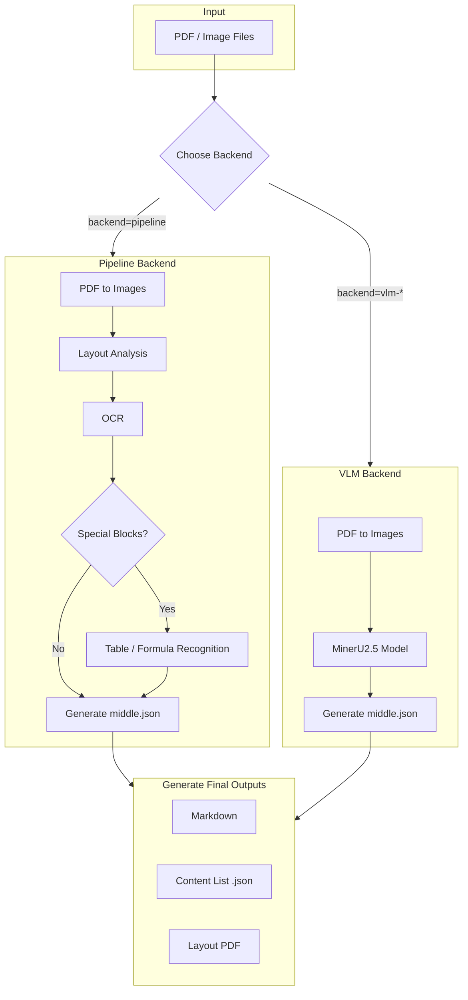

# MinerU 專案說明

你好！這份文件將帶你深入了解 MinerU 這個專案。我會用最簡單易懂的方式，讓你明白這個專案是做什麼的、有什麼酷炫的功能，以及它如何運作。

## 1. 本專案用途是什麼? 核心功能是什麼? 實際應用場景是什麼?

想像一下，你有一本掃描成 PDF 的舊書或一堆複雜的報告，裡面的文字、圖片、表格和數學公式全都混在一起。你沒辦法輕易地複製文字，也沒辦法搜尋裡面的內容。

**MinerU 就像一個擁有超能力的「文件魔法師」。**

它的核心任務就是讀取這些看起來很亂的 PDF 或圖片文件，然後像變魔術一樣，把它們轉換成電腦能夠理解的、條理分明的結構化資訊。

**核心功能：**

1. **智慧排版分析 (Layout Analysis):** 它能自動辨識文件中的標題、段落、圖片、表格、列表和程式碼區塊。
2. **光學字元辨識 (OCR):** 即使你的 PDF 是由圖片組成的，它也能準確地把圖片裡的文字「摳」出來，變成可以編輯的文字。
3. **表格與公式辨識 (Table & Formula Recognition):** 它能聰明地認出文件中的表格和數學公式，並把它們轉換成標準格式（例如 Markdown 表格和 LaTeX 數學式）。
4. **多格式輸出 (Multi-format Output):** 分析完成後，它可以產生多種格式的檔案，例如適合閱讀的 Markdown 文件和適合電腦程式處理的 JSON 檔案。

**實際應用場景：**

* **建立數位圖書館：** 將成千上萬本掃描的書籍轉換成可搜尋、可索引的電子資料庫。
* **自動化資料輸入：** 從發票、財報或研究報告中自動抽取出關鍵數據（例如金額、日期、表格內容），減少人工輸入的錯誤和辛勞。
* **知識庫建構：** 將公司內部大量的技術手冊、產品規格書轉換成統一格式的知識庫，方便員工快速查詢。
* **學術研究輔助：** 幫助研究人員快速整理科學論文中的內容，特別是複雜的表格和公式。

## 2. 本專案的 input/output 分別是什麼?

簡單來說，你給 MinerU 一個「原始資料」，它會回饋給你一堆「分析成果」。

**Input (輸入):**

* **PDF 檔案 (`.pdf`)**：這是最主要的輸入格式，無論是文字型 PDF 還是圖片型 PDF 都可以處理。
* **圖片檔案 (`.png`, `.jpg`, `.jpeg` 等)**：你也可以直接丟給它一張包含文字的圖片。

**Output (輸出):**

假設你輸入了一個名為 `demo1.pdf` 的檔案，MinerU 會在指定的輸出資料夾中，產生一個以 `demo1` 命名的子資料夾，裡面可能包含以下成果：

* `demo1.md`: **Markdown 文件**。這是最直觀的成果，它將原始文件的內容轉換成格式優美的 Markdown，保留了標題、列表、表格和圖片，非常適合人類閱讀。
* `demo1_content_list.json`: **簡化內容列表**。這是一個 JSON 檔案，用一個簡單的列表儲存了文件的主體內容，方便開發者快速取用。
* `demo1_middle.json`: **詳細結構化文件**。這是最核心、最詳細的輸出。它是一個 JSON 檔案，包含了 MinerU 對文件的所有分析結果，例如每個文字塊的位置、類型（是標題還是段落？）、表格的結構、圖片的路徑等等。這個檔案是後續進行二次開發的基礎。
* `demo1_model.json`: **原始模型輸出**。這個 JSON 檔案儲存了 AI 模型最原始的分析結果，主要用於偵錯和演算法研究。
* `demo1_layout.pdf`: **排版視覺化文件**。這是一個 PDF 檔案，它在原始文件的頁面上畫出了 MinerU 所辨識出的不同區塊（例如標題、段落、圖片），讓你一眼就能看出 AI 是如何「看」這份文件的。
* `images/` 資料夾: 如果原始文件中有圖片，MinerU 會把它們擷取出來，存放在這個資料夾裡。

## 3. 本專案用到那些 LLM ?

MinerU 像一個團隊，由多個各有所長的 AI 模型（其中有些是大型語言模型 LLM）協同工作。它主要有兩種工作模式，使用了不同的模型：

**模式一：Pipeline (流水線模式)**

這種模式像一個工廠流水線，每個模型專注於一項特定任務：

1. **排版分析模型 (Layout Model):** 負責理解文件的整體結構，區分標題、段落、圖片等區塊。
2. **光學字元辨識模型 (OCR Model):** 負責從圖片中辨識文字。
3. **表格辨識模型 (Table Model):** 專門用來辨識和重建表格的結構。
4. **公式辨識模型 (Formula Model):** 專門用來辨識數學公式。
5. **標題強化模型 (Title-aided LLM):** 在 `mineru.template.json` 中可以看到，這裡可以配置一個額外的 LLM（例如 `qwen2.5-32b-instruct`），用來潤飾或生成更精確的標題。預設是關閉的。

**模式二：VLM (視覺語言模型模式)**

這種模式使用一個更強大的「通才」模型，它能夠同時理解圖片和文字：

* **MinerU2.5 (VLM Model):** 這是一個強大的視覺語言模型。你只要把文件頁面的圖片丟給它，它就能一步到位，直接產生包含內容、結構和格式的完整分析結果，取代了上面流水線中的多個模型。

**舉例說明：**

* 當你處理一份包含複雜表格的財報時，在 **Pipeline 模式**下，排版模型會先框出表格的位置，然後 OCR 模型讀取文字，最後表格模型會分析行列結構，將其轉換為 Markdown 表格。
* 如果使用 **VLM 模式**，`MinerU2.5` 模型會直接「看」到這個表格，並在它的腦中形成一個結構化的概念，然後直接輸出類似「這是一個三行五列的表格，第一行是表頭...」的結構化資訊。

## 4. 調整配置參數會有哪些影響?

你可以透過調整配置參數，來客製化 MinerU 的行為。這些參數可以在執行命令時指定，或在設定檔中修改。

| 參數 (命令列) | 設定檔 (`.json`) | 說明 | 影響 |
| :--- | :--- | :--- | :--- |
| `-p`, `--path` | N/A | **輸入路徑**。指定要分析的單一檔案或整個資料夾。 | 這是必須的參數，決定了要處理哪個檔案。 |
| `-o`, `--output` | N/A | **輸出路徑**。指定分析結果要儲存到哪個資料夾。 | 這是必須的參數，決定了成果的存放位置。 |
| `-b`, `--backend` | N/A | **後端模式**。可選 `pipeline` 或 `vlm-*`。 | 這是最重要的選擇！`pipeline` 模式控制更精細，`vlm` 模式更簡單快速。 |
| `-m`, `--method` | N/A | **解析方法** (僅限 `pipeline` 模式)。可選 `auto`, `txt`, `ocr`。 | `auto` 會自動判斷；如果確定是純文字 PDF，用 `txt` 會更快；如果是掃描件，用 `ocr` 更準確。 |
| `-l`, `--lang` | N/A | **語言** (僅限 `pipeline` 模式)。例如 `ch`, `en`。 | 為 OCR 模型提供語言提示，可以顯著提升對應語言的文字辨識準確率。 |
| `-f`, `--formula` | N/A | **啟用公式辨識** (僅限 `pipeline` 模式)。`True` 或 `False`。 | 如果你的文件沒有數學公式，關閉此項 (`--formula False`) 可以稍微加快處理速度。 |
| `-t`, `--table` | N/A | **啟用表格辨識** (僅限 `pipeline` 模式)。`True` 或 `False`。 | 如果文件沒有表格，關閉此項 (`--table False`) 可以加快處理速度。 |
| `-d`, `--device` | N/A | **執行裝置**。例如 `cpu`, `cuda`。 | 指定要用 CPU 還是 GPU 來跑模型。使用 GPU (`cuda`) 會快非常多。 |
| `--source` | N/A | **模型來源**。可選 `huggingface`, `modelscope`, `local`。 | 決定從哪個平台下載 AI 模型。如果網路環境不同，可以切換來源。 |
| N/A | `latex-delimiter-config` | **LaTeX 分隔符號**。 | 控制輸出 Markdown 中數學公式的符號，例如行內公式用 `$` 包圍，獨立公式用 `$$` 包圍。 |
| N/A | `llm-aided-config` | **LLM 輔助設定**。 | 可以啟用一個額外的 LLM 來優化標題，但需要提供 API Key 且預設關閉。 |

## 5. 請提供完整執行過程步驟與系統架構

### 完整執行步驟 (以命令列為例)

假設我們要分析 `demo/pdfs/` 資料夾下的所有文件，並將結果儲存到 `demo/output/`。

**步驟 1: 準備環境**

確保你已經安裝好 MinerU 所需的環境。

**步驟 2: 執行命令**

打開你的終端機 (命令提示字元)，輸入以下命令：

```bash
# 使用 pipeline 模式，並指定語言為英文
mineru --path demo/pdfs/ --output demo/output/ --backend pipeline --lang en

# 或者，使用 vlm 模式
# mineru --path demo/pdfs/ --output demo/output/ --backend vlm-transformers
```

**步驟 3: 查看結果**

執行完畢後，到 `demo/output/` 資料夾下，你會看到每個輸入檔案對應的分析結果資料夾，裡面包含了 `.md`, `.json` 等檔案。

### 系統架構 (Mermaid 格式)

底下這張圖清楚地展示了 MinerU 的兩種核心工作流程：



## 6. 本專案在公司內部有哪些應用方向 ?

1. **智慧歸檔與搜尋：** 公司有大量掃描的合約、報告、病歷等歷史文件，可以利用 MinerU 將它們全部數位化，變成可全文搜尋的資料庫，未來找資料就不用再翻箱倒櫃了。
2. **財報自動分析：** 自動從上市公司的 PDF 財報中提取財務表格（資產負債表、利潤表等），將數據匯入到分析系統中，大大節省分析師的時間。
3. **法務合約審查輔助：** 將合約文件轉換為結構化文字後，可以利用程式自動檢查特定條款、關鍵字或金額，輔助法務人員進行初步審查。
4. **研發知識庫建立：** 將公司內部所有的技術規格書、專利文件、研究論文進行解析，建立一個統一的內部技術知識庫，加速新進員工的學習和研發人員的資料查詢。

## 7. 如果不依賴現有案例，要自行新增一個案例。建議新增哪個案例?

**建議新增「手寫信件或古代典籍」的案例。**

**為什麼?**

現有的案例大多是印刷體、格式相對工整的現代文件。而手寫文件或年代久遠的典籍帶來了全新的挑戰：

1. **字體風格多樣：** 每個人的筆跡都不同，甚至同一個人的字在不同時候也不同。這對 OCR 模型的辨識能力是極大的考驗。
2. **排版不規則：** 手寫文件的排版通常很隨意，沒有清晰的欄位或邊界。古代典籍可能是從右到左、從上到下書寫的。這對排版分析模型提出了更高的要求。
3. **文件品質差：** 舊文件常常伴隨著模糊、污漬、破損、紙張變色等問題，這些都會干擾模型的判讀。

**舉例說明：**

可以找一些公開領域的數位化手稿，例如達文西的手稿或一些書法作品的掃描件。

* **目標：** 嘗試使用 MinerU 解析這些手寫文件，看看它能在多大程度上正確辨識文字和排版。
* **價值：** 如果能成功應對這類挑戰，哪怕只是部分成功，都意味著 MinerU 的能力有巨大的擴展。這不僅能展示其強大的泛化能力，還能將其應用擴展到歷史研究、文獻整理、筆跡鑑定等更廣闊的領域。這將是一個非常酷且有價值的展示案例。

## 8. 針對專案有哪些需要補充說明的部分?

最需要補充說明的是 **`pipeline` 和 `vlm` 兩種後端模式的選擇與權衡**。

雖然前面提到了這兩種模式，但對於使用者來說，如何選擇可能依然是個疑問。

* **選擇 `pipeline` 模式的時機：**
  * **需要精細控制：** 當你只想執行特定步驟（例如，只想做排版分析，不需要 OCR），或者想替換流水線中的某個模型時。
  * **硬體資源受限：** `pipeline` 中的模型通常比單一的 VLM 模型小，對 GPU 記憶體的要求可能較低。
  * **特定任務優化：** `pipeline` 中的表格、公式辨識模型是專門訓練的，在處理大量複雜表格或公式的特定場景下，效果可能比通用 VLM 模型更好。

* **選擇 `vlm` 模式的時機：**
  * **追求簡單快速：** 當你希望用最簡單的方式，快速得到一個「八九不離十」的結果時。VLM 模式的配置更簡單，一步到位。
  * **處理通用文件：** 對於沒有太多奇特格式的常規文件（例如普通文章、報告），VLM 的效果通常已經足夠好。
  * **需要更豐富的語意理解：** VLM 因為是大型語言模型，它對內容的語意理解更深入，有時能辨識出更複雜的邏輯結構（例如程式碼區塊、問答對）。

**總結來說：**

* **`pipeline` 模式像是「專家團隊」**，每個專家各司其職，組合起來功能強大且靈活，但協調起來稍嫌複雜。
* **`vlm` 模式像是「超級天才」**，一個人搞定所有事，簡單高效，但在某些極端專業的領域可能不如專家深入。

理解這兩者的差異，能幫助使用者根據自己的具體需求和硬體條件，做出最合適的選擇。
